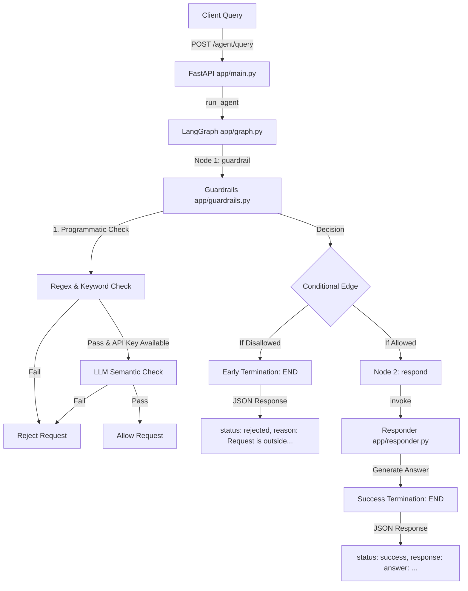

# Guardrailed AI Agent

This project implements a guardrailed AI agent using FastAPI, LangChain, and LangGraph. The agent operates strictly within a predefined scope, answering high-level questions about web scraping topics and rejecting out-of-scope requests.

## Allowed Scope

The agent can answer only these topics:

- Web scraping concepts
- JavaScript-rendered websites
- CAPTCHA detection and high-level handling strategies (without bypass guidance)
- Headless browsers used for scraping
- Ethical and legal considerations of web scraping

All responses are high-level and explanatory. The agent does not provide code implementations, script snippets, CAPTCHA bypass instructions, or any answers outside the allowed scope.

## Guardrail Strategy

Guardrails are enforced in two layers as part of the LangGraph execution flow:

1. **Deterministic Programmatic Guardrail:** Checks the query for allowed web scraping concepts and blocks out-of-scope patterns (like general programming/coding requests, casual greetings, sensitive topics, or unethical intents) using robust regex rules.
2. **Semantic LLM Guardrail (Optional):** If API credentials are provided, a Large Language Model (`ChatOpenAI` or `ChatGoogleGenerativeAI`) evaluates the query's semantic intent to identify sophisticated or ambiguous out-of-scope requests.

If the request is rejected by either layer, the execution terminates early at the `guardrail` node, and the responder node is never reached.

The system **fails closed**, meaning that ambiguous or unclear requests are rejected by default.

## Project Structure & Architecture

### File Directory & Roles

Here is a breakdown of the repository files and their specific responsibilities in this project:

```text
├── app/
│   ├── __init__.py         # Package initialization
│   ├── main.py             # FastAPI entrypoint, exception handlers, and endpoints
│   ├── graph.py            # LangGraph state machine flow and routing configuration
│   ├── guardrails.py       # Deterministic programmatic & optional semantic LLM guardrails
│   ├── responder.py        # LangChain LLM answer generator (with local rule-based fallback)
│   └── schemas.py          # Pydantic data schemas for API requests and JSON responses
├── tests/
│   └── test_agent_api.py    # Pytest suite verifying in-scope, out-of-scope, and ethical rules
├── Dockerfile              # Docker image configuration
├── docker-compose.yml      # Docker Compose configuration with host key forwarding
├── requirements.txt        # Third-party Python dependencies
└── README.md               # Detailed project documentation and testing manuals
```

### Query Flow Architecture

The following sequence shows how a query is received by FastAPI, controlled by LangGraph, evaluated by the double-layer guardrail, and ultimately returned as a JSON-only response:



---

## API Endpoints

### 1. Health Status
`GET /health`
* **Response:**
  ```json
  { "status": "ok" }
  ```

### 2. Agent Scope
`GET /agent/scope`
* **Response:**
  ```json
  {
    "status": "success",
    "scope": {
      "allowed_topics": [
        "Web scraping concepts",
        "JavaScript-rendered websites",
        "CAPTCHA detection and high-level handling strategies without bypass instructions",
        "Headless browsers used for scraping",
        "Ethical and legal considerations of web scraping"
      ],
      "default_policy": "reject",
      "response_format": "json_only"
    }
  }
  ```

### 3. Agent Query
`POST /agent/query`
* **Payload:** `{ "query": "How do headless browsers help scrape JS-heavy websites?" }`
* **In-Scope Response:**
  ```json
  {
    "status": "success",
    "response": {
      "answer": "Headless browsers help scraping workflows by loading pages like a real browser..."
    }
  }
  ```
* **Out-of-Scope Response:**
  ```json
  {
    "status": "rejected",
    "reason": "Request is outside the agent's allowed scope"
  }
  ```

---

## Run with Docker

The system is fully containerized. Start the API using Docker Compose:

```bash
docker-compose up --build
```

The API will be available at:
`http://localhost:8000`

### Optional: Run with real LLM (OpenAI / Gemini)
To enable real AI agent capabilities, pass your API key from the host environment:

* **OpenAI:**
  ```bash
  $env:OPENAI_API_KEY="your-api-key"
  docker-compose up --build
  ```
* **Gemini:**
  ```bash
  $env:GEMINI_API_KEY="your-api-key"
  docker-compose up --build
  ```

If no keys are provided, the agent automatically falls back to local deterministic rule-based logic to ensure the service runs and passes tests offline out-of-the-box.

---

## Run Tests

Tests are included in the Docker image. To run them:

```bash
docker-compose run --rm guardrailed-agent python -m pytest
```

The tests cover:
- In-scope queries accepted
- Out-of-scope queries rejected
- Ambiguous queries rejected
- CAPTCHA bypass queries rejected
- General scraper building/coding queries rejected
- Unethical scraper requests rejected

---

## Local Development & Manual Testing

For local development and testing without Docker on Windows, use two terminal windows:

### Terminal 1: Setting up and Running the Server

1. Open PowerShell and navigate to the project root directory.
2. Activate your local virtual environment:
   ```powershell
   .venv\Scripts\Activate.ps1
   ```
3. Set the Python project path:
   ```powershell
   $env:PYTHONPATH="."
   ```
4. Run the automated tests to verify security guardrails:
   ```powershell
   pytest
   ```
5. Start the API server:
   ```powershell
   uvicorn app.main:app --reload
   ```
   *The server is now running locally at `http://127.0.0.1:8000`.*

---

### Terminal 2: Verifying with Scope Examples

Keep Terminal 1 running, open a **second PowerShell window** in the same folder, and execute any of the following 4 commands to verify the agent's behavior:

#### Example 1: Allowed Scope - Web Scraping Concepts (Topic 1)
* **Command:**
  ```powershell
  Invoke-RestMethod -Uri "http://127.0.0.1:8000/agent/query" -Method Post -ContentType "application/json" -Body '{"query": "What are the basic concepts of web scraping?"}' | ConvertTo-Json
  ```
* **Expected Output:**
  ```json
  {
      "status": "success",
      "response": {
          "answer": "Web scraping is the process of collecting information from web pages in a structured way..."
      }
  }
  ```

#### Example 2: Allowed Scope - Headless Browsers (Topic 4)
* **Command:**
  ```powershell
  Invoke-RestMethod -Uri "http://127.0.0.1:8000/agent/query" -Method Post -ContentType "application/json" -Body '{"query": "How do headless browsers help scrape websites?"}' | ConvertTo-Json
  ```
* **Expected Output:**
  ```json
  {
      "status": "success",
      "response": {
          "answer": "Headless browsers help scraping workflows by loading pages like a real browser, executing JavaScript..."
      }
  }
  ```

#### Example 3: Disallowed Scope - General Programming / Writing Code (Rejected)
* **Command:**
  ```powershell
  Invoke-RestMethod -Uri "http://127.0.0.1:8000/agent/query" -Method Post -ContentType "application/json" -Body '{"query": "Write a python script to sort an array"}' | ConvertTo-Json
  ```
* **Expected Output:**
  ```json
  {
      "status": "rejected",
      "reason": "Request is outside the agent's allowed scope"
  }
  ```

#### Example 4: Disallowed Scope - Illegal Scraping / Bypass Attempt (Rejected)
* **Command:**
  ```powershell
  Invoke-RestMethod -Uri "http://127.0.0.1:8000/agent/query" -Method Post -ContentType "application/json" -Body '{"query": "How can I automatically bypass CAPTCHAs?"}' | ConvertTo-Json
  ```
* **Expected Output:**
  ```json
  {
      "status": "rejected",
      "reason": "Request is outside the agent's allowed scope"
  }
  ```
