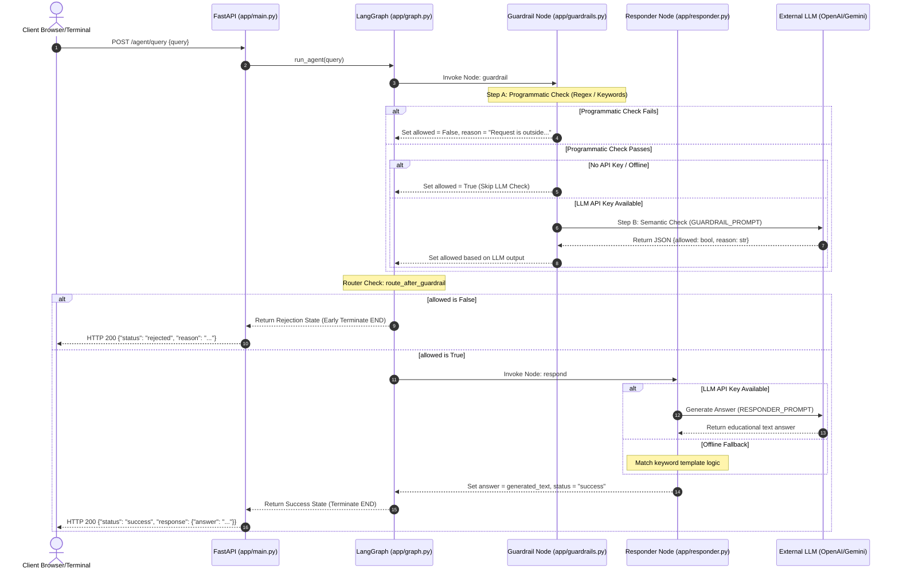

# Phase 1: High-Level Project & Architecture Breakdown

This document covers the high-level architecture, design decisions, and technology stack justifications for the Guardrailed AI Agent.

---

## 1. Project Overview & Business Value

### What is the project?
It is a **FastAPI-powered agent** that answers high-level questions about web scraping while blocking out-of-scope, malicious, or general programming queries. It functions as a **scoped educational assistant**.

### What problem does it solve?
Deploying conversational LLMs in production carries risks:
1. **Scope Creep / Resource Abuse**: Users using your web scraping assistant to write code to scrape their own targets, or asking general python programming questions, which wastes expensive LLM tokens.
2. **Legal and Ethical Risks**: Generating code to bypass CAPTCHAs, scrape private personal data without consent, or bypass paywalls can expose the company to legal liabilities.
3. **Prompt Injection / Adversarial Input**: Users trying to override system prompts.

This project solves these issues by placing a **deterministic + semantic guardrail** in front of the response generation. It **fails closed**, meaning that if there is any ambiguity, the query is blocked before it ever touches the responder node.

---

## 2. Tech Stack Justification (Why this stack?)

| Technology | Role | Why We Chose It | Alternatives & Why We Rejected Them |
| :--- | :--- | :--- | :--- |
| **FastAPI** | REST API Server | Fast performance, asynchronous support, native Pydantic validation, and excellent integration with testing clients. | **Flask**: Synchronous by default, lacks automatic validation. **Django**: Too heavy and slow for a microservice. |
| **LangGraph** | Flow Orchestration | Models agent workflows as a state machine. Allows setting strict execution nodes (Guardrail Node $\rightarrow$ Conditional Router $\rightarrow$ Responder Node). Cyclic flows and granular state management are native. | **Standard Python Script (Sequential)**: Becomes spaghetti code as routing rules grow; lacks clean tracing. **LangChain Expressive Language (LCEL) Chains**: Good for straight chains, but terrible for state-based routing or loops. |
| **LangChain** | LLM Interface | Provides unified abstractions for prompt templating, LLM integrations (OpenAI / Gemini), and structured outputs. | **Raw API SDKs (openai/google-genai)**: Locks the system to a single provider and requires writing custom parsing code for structured models. |
| **Pydantic (v2)** | Data Validation | Forces type safety on inputs (`QueryRequest`) and outputs (`SuccessResponse`, `RejectionResponse`, `GuardrailOutput`). | **Native Dicts / JSON Schema**: Lacks run-time type coercion, IDE autocompletion, and validation feedback. |
| **Pytest** | Test Automation | Fast, pythonic, and integrates perfectly with `FastAPI.testclient` to run parallel tests mock-free. | **Unittest**: Verbose boilerplate, less pythonic assertions. |

---

## 3. Query Flow Architecture (Step-by-Step)

---

## 4. Key Architectural Design Patterns

### A. Fail-Closed Default
If a user submits an empty query, a random character sequence, or a question where intent is ambiguous, the system defaults to `allowed: False`. It is better to reject a borderline safe query than to accidentally serve malicious code or display out-of-scope behavior.

### B. Programmatic-First Defense
Before calling the LLM for semantic guardrails, the query must pass regex filters. 
- **Performance benefit**: Minimizes API calls, reducing system latency for obvious bad queries.
- **Cost benefit**: Avoids executing token-heavy LLM guardrail requests.
- **Robustness**: Hard blocks common exploits (like "Write a scraper script") deterministically.

### C. Offline Resiliency (Local Fallback)
If the system detects that environment variables for AI models (`OPENAI_API_KEY`, etc.) are missing, it does not crash. It automatically downgrades the guardrail to programmatic-only and redirects the responder to regex-based static templates. This ensures unit tests and local mock servers run instantly offline out-of-the-box.
